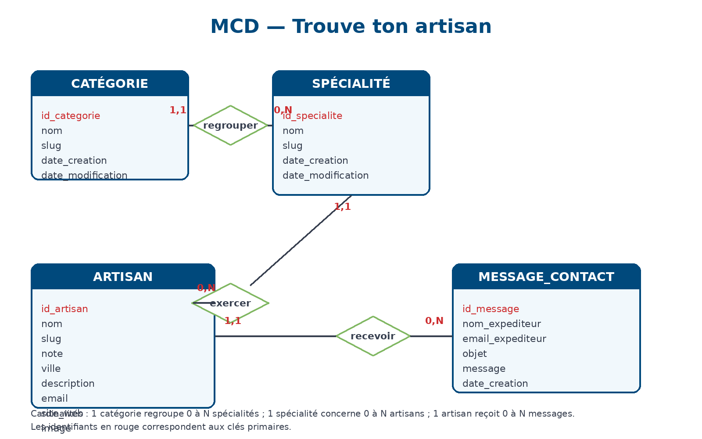
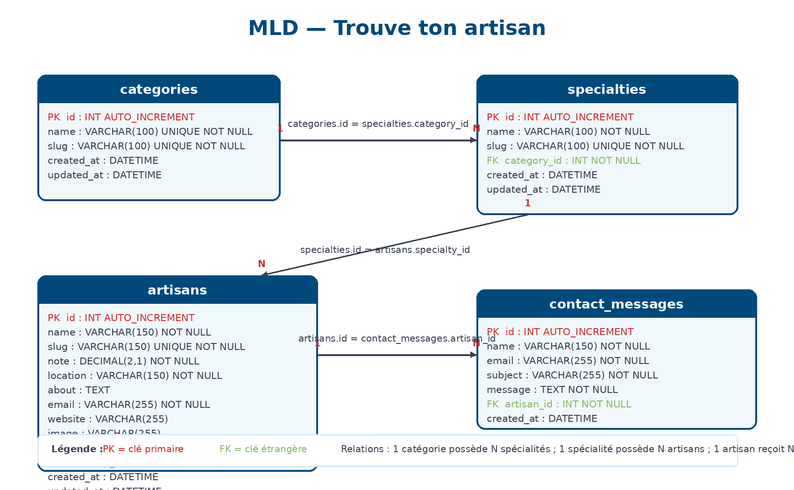
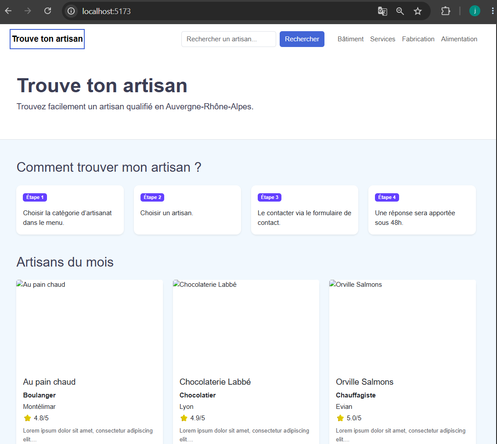

# Trouve ton artisan


Application web permettant de rechercher des artisans en Auvergne-Rhône-Alpes et de les contacter via un formulaire.

## Sommaire

- [Aperçu du projet](#aperçu-du-projet)
- [Technologies](#technologies)
- [Installation](#installation)
- [Base de données](#base-de-données)
- [Captures d’écran](#captures-décran)
- [Architecture du projet](#architecture-du-projet)
- [Fonctionnalités](#fonctionnalités)
- [Sécurité](#sécurité)
- [Validation W3C](#validation-w3c)
- [Auteur](#auteur)
- [Licence](#licence)
- [Application en ligne](#application-en-ligne)

## Prérequis

- Node.js >= 18
- MySQL >= 8
- npm

## Aperçu du projet

Plateforme permettant :

- rechercher un artisan,
- filtrer par catégorie,
- consulter les détails,
- envoyer un message de contact.

## Technologies

### Frontend

Le frontend fonctionne sur : http://localhost:5173

- React.js
- Bootstrap
- Sass
- React Router
- Axios

### Backend

Le backend fonctionne sur : http://localhost:5000

- Node.js
- Express
- Sequelize
- MySQL
- Nodemailer

## Installation

### 1. Cloner le projet

```bash
git clone <url-du-repository>
cd Trouve-ton-artisan
```

### 2. Installer le frontend

```bash
cd client
npm install
npm run dev
```

### 3. Installer le backend

```bash
cd server
npm install
npm run dev
```

## Configuration

### Variables d’environnement backend

Créer un fichier .env dans server :

```env
PORT=5000
DB_HOST=127.0.0.1
DB_PORT=3308
DB_NAME=trouve_ton_artisan
DB_USER=root
DB_PASSWORD=

CLIENT_URL=http://localhost:5173

SMTP_HOST=
SMTP_PORT=587
SMTP_USER=
SMTP_PASS=
```

## Base de données

Créer la base de données avec :

database/schema.sql

Puis insérer les données avec :

database/seed.sql

### MCD



### MLD



## Captures d’écran

### Accueil



### Recherche


### Détail artisan


## Scripts

### Frontend

```bash
npm run dev
npm run build
```

### Backend

```bash
npm run dev
npm start
```

## Fonctionnalités

- Affichage des artisans par catégorie
- Recherche d’artisans
- Page détail artisan
- Formulaire de contact
- Pages légales en construction
- Page 404
- Responsive mobile/tablette/desktop
- SEO avec titres et descriptions dynamiques
- API REST avec validation des données et sécurisation des requêtes

### Maquettes Figma

- Version desktop
- Version tablette
- Version mobile

Lien Figma :

https://www.figma.com/design/IE3yzo98u8i6pCPBzguJ3u/Trouve-ton-artisan?node-id=0-1&p=f&t=MABri2icxo7Wf7h0-0

## Architecture du projet

```txt
Trouve-ton-artisan/
│
├── client/
│   ├── src/
│   ├── public/
│   └── package.json
│
├── server/
│   ├── controllers/
│   ├── routes/
│   ├── models/
│   ├── middlewares/
│   └── package.json
│
├── database/
├── docs/
└── README.md
```

## Sécurité

- Protection des headers HTTP avec Helmet
- CORS configuré
- Limitation des requêtes sur le formulaire de contact
- Validation backend avec express-validator
- Requêtes SQL sécurisées via Sequelize
- Variables sensibles stockées dans .env

## Validation W3C

Les validations HTML et CSS sont disponibles dans :

docs/validation/w3c-html.png
docs/validation/w3c-css.png

## Application en ligne

Frontend :

[Voir le site](https://trouve-ton-artisan-sepia.vercel.app/)

Backend API :

[Voir l’API](https://dashboard.render.com/web/srv-d87jsvv7f7vs739tvm90/deploys/dep-d87ka8vavr4c73bnpc20?r=2026-05-21%4017%3A46%3A15%7E2026-05-21%4017%3A49%3A17)

## Auteur

Projet réalisé par Jimmy Châtelier dans le cadre du devoir “Trouve ton artisan”.

## Licence

Projet pédagogique réalisé dans le cadre de la formation développeur web CEF.
